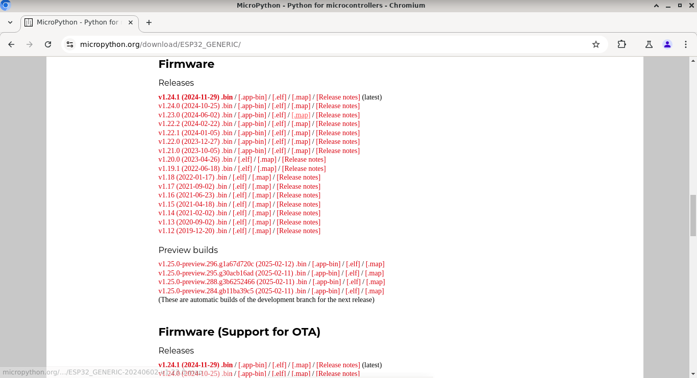
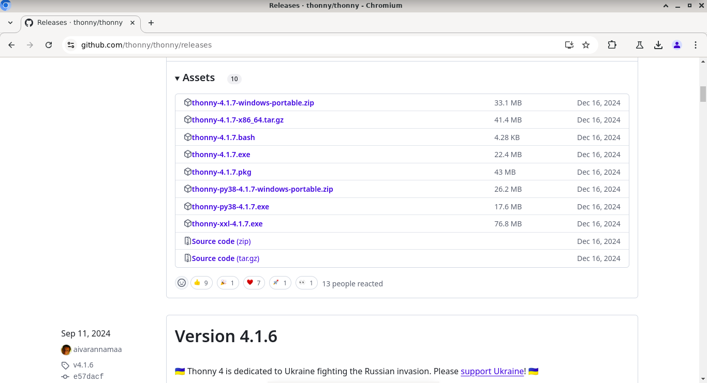
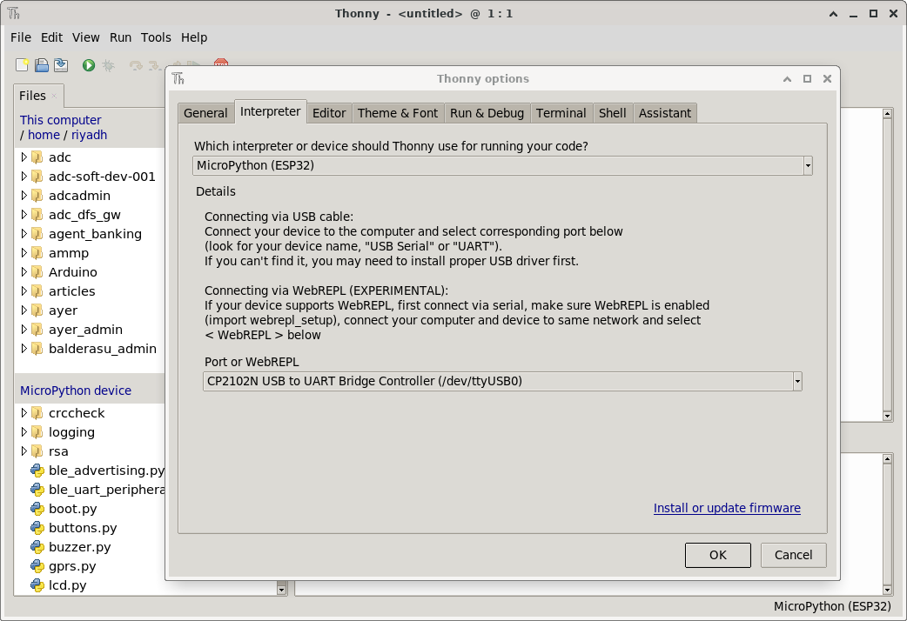
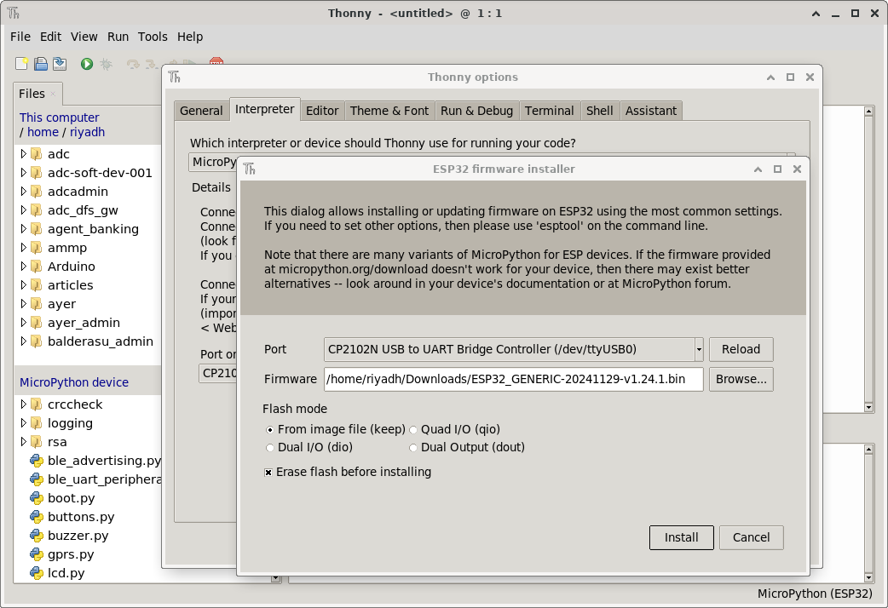

## Preparing the ESP32 DevKitC and Development Environment

Download the latest Micropython firmware from https://micropython.org/download/ESP32_GENERIC/.

Download the Thonny Python IDE for your operating system from https://github.com/thonny/thonny/releases and install (follow the instructions on this page for your platform).

Connect the ESP32 DevkitC module to a USB port on your computer.
Start the Thonny IDE and click on the button at the bottom right and select "Configure Interpreter" to open the "Thonny Options" dialog, . 

From the drop down at the top "Which interpreter..." select "Micropyton (ESP32)". From the lower drop down "Port or WebREPL" select "C2102N USB to UART bridge...(/dev/ttyUSB0)" or (COM1, COM2... on Windows).

Click on "Install or update firmware" at the bottom right. Again select the "Port" and then the "Browse" button to find the Micropython firmware file you have downloaded. Following this click on the "Install" button at the bottom right.

 You should then end up with a Micropython REPL prompt as shown below.

## Using the REPL

The Read Evaluate Print Loop (REPL) allows you to enter a Python command which is then evaluated by the interpreter and the result of the evaluation printed out. 

`>>> 1 + 1`

`2`

`>>> 3 / 2`

`1.5`

`>>> def my_cube (x):`

`         return x * x * x` 

`>>> my_cube(3)`

`27`

